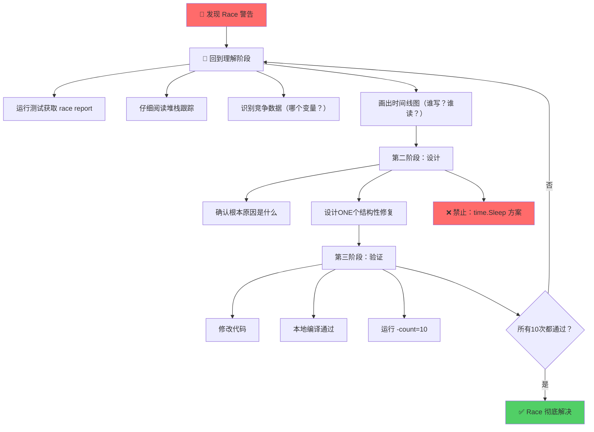
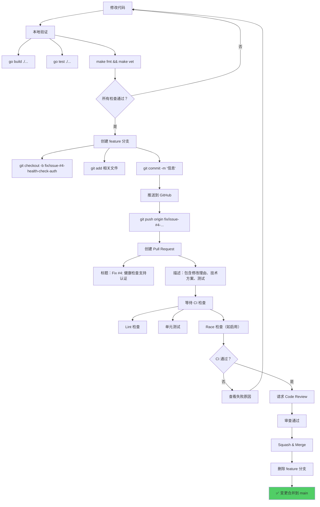
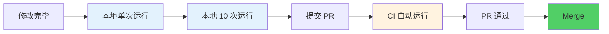

# Go 并发编程教材：WaitGroup 同步与 Race 条件调试

**文档版本**: v1.0  
**发布日期**: 2026-04-03  
**适用范围**: Go 项目中所有包含长生命周期 goroutine 的代码  
**难度等级**: 中级 → 高级  
**学习时间**: 30-45 分钟

---

## 📌 核心要点（3 秒速览）

| 概念 | 要点 |
|------|------|
| **WaitGroup 同步** | 必须跟踪**所有**长生命周期 goroutine（主循环+子任务），不仅仅是子任务 |
| **Race 调试** | Race 是**架构问题**，不是时序问题；结构性修复，不用 `time.Sleep()` |
| **测试清理** | 显式 `cancel()` 后 `Wait()`，保证所有 goroutine 退出后才能清理环境 |

---

## 1️⃣ 真实案例背景

### 问题现象

项目 `internal/lb/health_test.go` 中的健康检查测试不稳定：
- 本地开发环境偶尔通过
- CI 流程中间歇性失败
- 错误信息：`WARNING: DATA RACE` 

```
Write at 0x... by goroutine 24:
    sync.(*WaitGroup).Add()  ← 子任务尝试增加计数器
    health.go:248

Previous read at 0x... by goroutine 23:
    sync.(*WaitGroup).Wait() ← 测试线程等待所有任务完成
    health.go:56
```

### 问题影响

- 测试非确定性：有时过有时不过
- CI/CD 流程断裂：无法稳定发版
- 调试困难：20% 的时间通过，难以重现

---

## 2️⃣ 根本原因分析

### 错误的代码结构

```go
type HealthChecker struct {
    wg sync.WaitGroup
}

// ❌ 错误：主循环 goroutine 没有被 WaitGroup 追踪
func (hc *HealthChecker) Start(ctx context.Context) {
    // 缺少: hc.wg.Add(1)
    go hc.loop(ctx)  // 主循环未被计数
}

func (hc *HealthChecker) loop(ctx context.Context) {
    defer hc.wg.Done()  // 无对应的 Add(1)，不会被执行
    
    ticker := time.NewTicker(30 * time.Second)
    defer ticker.Stop()
    
    for {
        select {
        case <-ctx.Done():
            return
        case <-ticker.C:
            hc.checkAll()  // 每 30 秒生成子任务
        }
    }
}

func (hc *HealthChecker) checkAll() {
    for _, target := range targets {
        hc.wg.Add(1)  // ← 主循环 goroutine 在这里修改计数器！
        go func(t Target) {
            defer hc.wg.Done()
            hc.checkOne(t)
        }(target)
    }
}

func (hc *HealthChecker) Wait() {
    hc.wg.Wait()  // ← 测试线程在这里读取计数器
}
```

### 并发竞争的执行时间线

```
时刻 T1: 测试调用 hc.Start()
        └─ 生成 loop() goroutine（未被 Add）
        
时刻 T2: 测试调用 cancel() 发信号
        
时刻 T3: 测试调用 hc.Wait()
        └─ 检查 WaitGroup 计数器（此时为 0，因为 loop 未计入）
        └─ 立即返回！

时刻 T4: loop() 继续运行，执行 checkAll()
        └─ hc.wg.Add(1) 修改计数器 ← DATA RACE！
            （测试线程正在清理资源）

时刻 T5: 子 goroutine 完成，调用 Done()
        
时刻 T6: 测试环境清理，zaptest logger 关闭
        
时刻 T7: 子 goroutine 尝试写日志
        └─ logger 已销毁 ← 另一个 RACE！
```

### 为什么说"是架构问题，不是时序问题"？

```go
// ❌ 错误的调试方向：尝试用 sleep 隐藏
cancel()
time.Sleep(100 * time.Millisecond)  // 寄希望于在这段时间内所有 goroutine 完成
hc.Wait()

// 问题：
// 1. 本地 sleep 100ms 足够了，CI 慢速机器可能 150ms 才完成
// 2. 竞争条件的根本原因未消除
// 3. 只是"碰运气"，不是真正的修复
// 4. 测试越来越脆弱

// ✅ 正确的方向：架构性修复
// 根本问题：WaitGroup 计数器不完整
// 解决方案：正确建账（Add/Done 必须配对，包括主循环）
```

---

## 3️⃣ 解决方案（正确的架构）

### 核心规则

```
┌─────────────────────────────────────────────────┐
│  WaitGroup 同步规则：                           │
│                                                  │
│  每个长生命周期 goroutine：                     │
│    1. 启动时：wg.Add(1)                        │
│    2. 函数开头：defer wg.Done()                │
│    3. 确保成对出现                             │
│                                                  │
│  长生命周期 = 循环体 / 事件监听                │
│           ≠ 一次性任务（for 循环内部）        │
└─────────────────────────────────────────────────┘
```

### 正确的代码

```go
type HealthChecker struct {
    wg sync.WaitGroup  // 追踪所有 goroutine
}

// ✅ 正确：主循环被显式追踪
func (hc *HealthChecker) Start(ctx context.Context) {
    hc.wg.Add(1)       // ← 添加计数：主循环
    go hc.loop(ctx)
}

// ✅ 正确：defer Done() 必须是第一行
func (hc *HealthChecker) loop(ctx context.Context) {
    defer hc.wg.Done() // ← 匹配 Start() 中的 Add(1)
    
    ticker := time.NewTicker(30 * time.Second)
    defer ticker.Stop()
    
    // 启动时立即检查一轮
    hc.checkAll()
    
    for {
        select {
        case <-ctx.Done():
            return  // Done() 被 defer 自动调用
        case <-ticker.C:
            hc.checkAll()
        }
    }
}

// 子任务也被追踪
func (hc *HealthChecker) checkAll() {
    targets := hc.balancer.Targets()
    
    for _, t := range targets {
        hc.wg.Add(1)  // ← 添加计数：每个子任务
        go func(target Target) {
            defer hc.wg.Done()  // ← 匹配上面的 Add(1)
            hc.checkOne(target)
        }(t)
    }
}

// Wait 阻塞直到所有 goroutine 完成
func (hc *HealthChecker) Wait() {
    hc.wg.Wait()
}
```

---

## 4️⃣ 执行流程与 GitHub 工作流

### 流程 1：正确的调试流程（3 阶段）



### 流程 2：代码提交与 PR 流程



### 流程 3：完整的测试验证流程



---

## 5️⃣ 详细的代码示例与对比

### 示例 1：主循环 goroutine 追踪

```go
// ❌ 常见错误
type Worker struct {
    wg sync.WaitGroup
}

func (w *Worker) Start(ctx context.Context) {
    // 缺少 wg.Add(1)！
    go w.loop(ctx)
}

func (w *Worker) loop(ctx context.Context) {
    defer w.wg.Done()  // 计数不匹配！
    // ...
}

// ✅ 正确做法
func (w *Worker) Start(ctx context.Context) {
    w.wg.Add(1)  // ← 关键：跟踪主循环
    go w.loop(ctx)
}

func (w *Worker) loop(ctx context.Context) {
    defer w.wg.Done()  // ← 匹配上面的 Add(1)
    // ...
}
```

### 示例 2：测试清理

```go
// ❌ 错误：没有等待 goroutine 完成
func TestWorkerBasic(t *testing.T) {
    w := NewWorker(zaptest.NewLogger(t))
    ctx, _ := context.WithCancel(context.Background())
    
    w.Start(ctx)
    time.Sleep(100 * time.Millisecond)
    
    // 测试结束，但 goroutine 还在运行！
}

// ✅ 正确：显式等待所有 goroutine
func TestWorkerBasic(t *testing.T) {
    logger := zaptest.NewLogger(t)
    w := NewWorker(logger)
    
    ctx, cancel := context.WithCancel(context.Background())
    defer cancel()  // 保险：确保总会取消
    
    w.Start(ctx)
    time.Sleep(100 * time.Millisecond)
    
    // 关键：显式清理
    cancel()  // ← 信号所有 goroutine 停止
    w.Wait()  // ← 等待所有 goroutine 实际退出
    
    // 现在安全：所有 goroutine 已完全退出
    // logger 可以安全销毁
}
```

### 示例 3：异步通知与日志

```go
// ❌ 错误：zaptest logger 在 async goroutine 中被访问
func TestWithNotifier_Wrong(t *testing.T) {
    hc := NewHealthChecker(zaptest.NewLogger(t))
    notifier := NewNotifier(zaptest.NewLogger(t), webhookURL)
    //                       ↑ zaptest logger
    hc.SetNotifier(notifier)
    
    hc.RecordFailure("target-1")  // 触发异步 webhook 发送
    
    // 测试结束，logger 销毁
    // 但 notifier.send() goroutine 还在试图写日志
    // → DATA RACE!
}

// ✅ 正确：async goroutine 使用 zap.NewNop()
func TestWithNotifier_Correct(t *testing.T) {
    hc := NewHealthChecker(zaptest.NewLogger(t))
    // ← 主线程用 zaptest logger（会被销毁）
    
    notifier := NewNotifier(zap.NewNop(), webhookURL)
    //                       ↑ zap.NewNop()：无操作 logger
    // ← async 线程用 NewNop()（永远活着，不会 race）
    hc.SetNotifier(notifier)
    
    hc.RecordFailure("target-1")
    
    // 安全：async logger 不会与 zaptest logger 竞争
}
```

---

## 6️⃣ 常见错误与修复

### 错误 #1：遗漏主循环追踪

```go
// 症状：Wait() 返回太快，子 goroutine 仍在运行

// 诊断：查看 Start() 和 loop()
// ❌ Start() 中没有 wg.Add(1)

// 修复：添加两行代码
func (h *HealthChecker) Start(ctx context.Context) {
    h.wg.Add(1)  // ← 添加这行
    go h.loop(ctx)
}

func (h *HealthChecker) loop(ctx context.Context) {
    defer h.wg.Done()  // ← 必须已有这行
    // ...
}
```

### 错误 #2：使用 time.Sleep 代替 Wait

```go
// 症状：偶尔通过，偶尔失败（非确定性）
// 原因：不同机器/负载下 sleep 时间不足

// ❌ 错误的 "修复"
cancel()
time.Sleep(200 * time.Millisecond)  // 希望足够久
hc.Wait()

// ✅ 正确的修复
cancel()
hc.Wait()  // 无条件等待所有 goroutine 完成
```

### 错误 #3：忘记 defer cancel()

```go
// 症状：测试 panic 时 goroutine 泄漏

// ❌ 不够健壮
ctx, cancel := context.WithCancel(context.Background())
hc.Start(ctx)
// ... 如果这里 panic，cancel() 不会被调用

// ✅ 健壮的做法
ctx, cancel := context.WithCancel(context.Background())
defer cancel()  // ← 保证无论什么情况都会执行
hc.Start(ctx)
```

---

## 7️⃣ 团队 GitHub 工作流

### 完整的 PR 提交步骤

```bash
# 1️⃣ 本地开发与验证
git checkout -b fix/issue-4-health-check-auth

# 修改代码...

# 2️⃣ 本地检查（必须全部通过）
go build ./...              # 编译
go test ./...               # 单元测试
go fmt ./...                # 代码格式
go vet ./...                # 静态分析
golangci-lint run ./...     # lint

# 3️⃣ 针对 race 敏感的代码进行深度测试
go test ./internal/lb -count=10  # 运行 10 次确保无随机性

# 4️⃣ 提交代码
git add internal/lb/health.go internal/lb/health_test.go
git add docs/CONCURRENCY_GUIDELINES.md

git commit -m "fix(health): support authentication in active health check

Add credentials mapping for provider-aware auth injection.
- Implement TargetCredential struct
- Add injectAuth() method for Bearer/x-api-key
- Support Anthropic, OpenAI, Ollama providers
- Fixes #4: health checks with API key authentication
- Add 10 comprehensive test cases
- Update WaitGroup tracking documentation

Co-Authored-By: Claude Haiku 4.5 <noreply@anthropic.com>"

# 5️⃣ 推送到远程
git push origin fix/issue-4-health-check-auth

# 6️⃣ 在 GitHub Web 界面创建 PR
# - 标题：fix(health): support authentication in active health check
# - 描述：包含修改理由、技术方案、测试覆盖
# - 关联 issue：Fixes #4

# 7️⃣ 等待 CI 通过
# - GitHub Actions 会自动运行 lint、test 等

# 8️⃣ 根据 review 意见修改（如需要）
# git add ...
# git commit --amend
# git push origin fix/issue-4-health-check-auth --force-with-lease

# 9️⃣ PR 批准后，Squash & Merge
# （通过 GitHub Web 界面）

# 🔟 清理本地分支
git checkout main
git pull origin main
git branch -d fix/issue-4-health-check-auth
```

### GitHub PR 描述模板

```markdown
## 问题描述
无认证的 LLM API（如 Anthropic、OpenAI）无法通过健康检查。
修复 #4

## 技术方案
1. 添加 TargetCredential struct 存储 API key
2. 实现 injectAuth() 方法注入认证头
3. 支持多个 provider 的不同认证方式：
   - Anthropic: x-api-key + anthropic-version
   - OpenAI/others: Authorization Bearer

## 修改清单
- [ ] HealthChecker 添加 credentials 映射
- [ ] 实现 injectAuth() 方法
- [ ] checkOneWithPath() 调用 injectAuth()
- [ ] SyncLLMTargets 构建 credentials 映射
- [ ] 10 个测试用例覆盖各 provider

## 测试清单
- [x] `go test ./internal/lb -count=10` 通过
- [x] `go vet ./...` 无错误
- [x] `golangci-lint run ./...` 无错误
- [x] 新增 10 个单元测试
- [x] 覆盖 Anthropic/OpenAI/无认证三种场景

## 相关文档
参见：`docs/CONCURRENCY_GUIDELINES.md`（WaitGroup 同步最佳实践）
```

---

## 8️⃣ 最佳实践检查清单

在写任何包含长生命周期 goroutine 的代码前，确保遵循：

### 代码编写阶段
- [ ] 标识所有长生命周期 goroutine（主循环、事件监听）
- [ ] 每个都有 `wg.Add(1)` 在启动时
- [ ] 每个都有 `defer wg.Done()` 作为第一行
- [ ] 子任务 for 循环内的 goroutine 也要追踪
- [ ] 在容易遗漏的地方添加注释说明为什么需要 Add/Done

### 测试编写阶段
- [ ] 创建 context：`ctx, cancel := context.WithCancel(...)`
- [ ] 添加 defer：`defer cancel()` 在函数开头
- [ ] 启动：`w.Start(ctx)`
- [ ] 工作：`time.Sleep()` 等待异步操作
- [ ] 清理：`cancel()` 发信号
- [ ] 等待：`w.Wait()` 确保所有 goroutine 完全退出
- [ ] async 代码使用 `zap.NewNop()` 而非 `zaptest.NewLogger()`

### 代码提交阶段
- [ ] 本地 `go build ./...` 无错误
- [ ] 本地 `go test ./...` 通过
- [ ] 针对 race 敏感代码：`go test ./pkg -count=10` 通过
- [ ] `go fmt` / `go vet` / `golangci-lint` 无错误
- [ ] PR 描述清晰、包含技术方案
- [ ] 等待 CI 全部通过

### PR 审查阶段（团队成员）
- [ ] WaitGroup 追踪是否完整？
- [ ] defer Done() 是否在函数开头？
- [ ] 测试是否有显式 cancel() + Wait()?
- [ ] Async 代码的日志是否避免了 zaptest logger?
- [ ] 有无 time.Sleep() 用作同步？

---

## 9️⃣ 学习资源与参考

### 核心文档
- 项目文档：`docs/CONCURRENCY_GUIDELINES.md` — 完整的并发编程指南
- 代码实例：`internal/lb/health.go` — 生产级实现
- 测试实例：`internal/lb/health_test.go` — 完整的测试模式

### 项目记忆库
- `memory/concurrency_waitgroup_patterns.md` — WaitGroup 模式集合
- `memory/concurrency_race_debugging.md` — Race 调试方法论
- `memory/test_lifecycle_patterns.md` — 测试生命周期管理

### 官方资源
- Go Blog: [Introducing the Go Race Detector](https://go.dev/blog/race-detector)
- Go 源码: `sync/waitgroup.go`
- Go 官文: [Effective Go - Concurrency](https://golang.org/doc/effective_go#concurrency)

---

## 🔟 总结与关键要点

```
┌────────────────────────────────────────────────────┐
│ 三个黄金规则（必须遵守）                           │
├────────────────────────────────────────────────────┤
│                                                     │
│ 规则 #1: WaitGroup 追踪所有长生命周期 goroutine    │
│          ├─ 主循环：wg.Add(1) 在 Start()         │
│          ├─ defer wg.Done() 在函数开头          │
│          └─ 子任务：for 内的 go func 也要追踪    │
│                                                     │
│ 规则 #2: Race 是架构问题，用结构性修复            │
│          ├─ ❌ 禁止 time.Sleep() 隐藏 race       │
│          ├─ ✅ 正确 WaitGroup 计数              │
│          └─ 验证：-count=10 确保确定性           │
│                                                     │
│ 规则 #3: 测试清理必须显式                         │
│          ├─ defer cancel() 保险                   │
│          ├─ cancel() 发信号停止                   │
│          ├─ Wait() 等待所有 goroutine 完成      │
│          └─ 异步代码用 zap.NewNop()              │
│                                                     │
└────────────────────────────────────────────────────┘
```

### 本文的收获

| 学习目标 | 收获 |
|---------|------|
| 理解 WaitGroup | 必须追踪所有 goroutine，包括主循环 |
| 调试 Race | 是架构问题；理解→设计→验证三阶段 |
| 写可靠测试 | 显式 cancel/Wait，异步用 NewNop() |
| GitHub 工作流 | -count=10 验证，清晰的 PR 描述 |

### 下一步行动

1. **阅读** — 仔细研读 `docs/CONCURRENCY_GUIDELINES.md`
2. **实践** — 在自己的代码中应用这三个规则
3. **审查** — 用检查清单审查他人的并发代码
4. **分享** — 在团队内分享本文档

---

**最后的话**

Race condition 的根本原因通常就这几种：WaitGroup 计数不完整、共享变量无锁保护、goroutine 清理不彻底。这篇文档总结的经验来自一次 7 小时的真实调试过程。希望它能帮你避免同样的坑，让你的 Go 并发代码更加健壮可靠。

*Keep goroutines synchronized. Sleep is never a fix.* 💪
